# Nginx
Итак, Nginx к началу выполнения лабы уже установлен (ещё на паре), так что начинаем с места в карьер.

Для начала зайдём в /etc/nginx/sites-enabled/default с помощью команды
```
sudo nano /etc/nginx/sites-enabled/default
```
И... что мы там видим??? Кучу комментов!

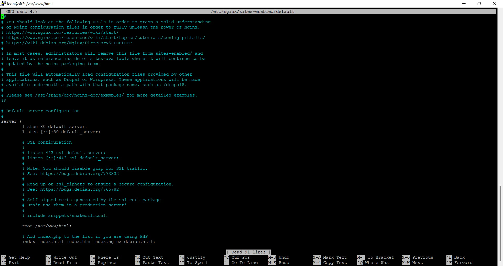

Убираем весь этот мусор, после чего меняем строчку
```
root /var/www/html
```
на 
```
root /var/www/html/app1
```
ибо нам надо, чтобы первое приложение лежало именно там.

Вот так-то лучше, не правда ли?)

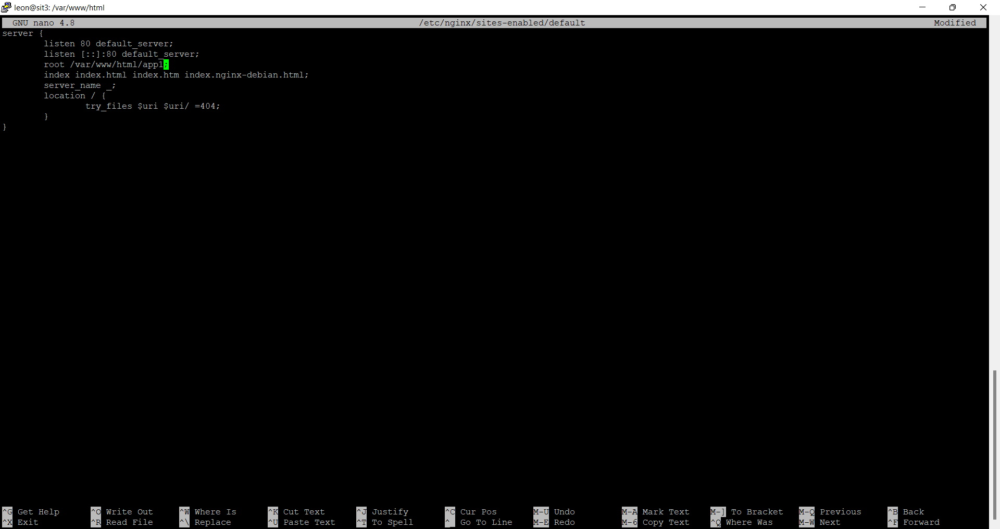

Хорошо. Теперь нам надо создать само первое приложение. Переходим в аудиторию /var/www/html/ с помощью cd, там создаём новую папочку app1
```
sudo mkdir app1
```
а в ней создаём новый файл index.html
```
sudo nano /var/www/html/app1/index.html
```

Сам код первого приложения я просто скопипастил из одной из первых лаб по фронтенду. Вот:

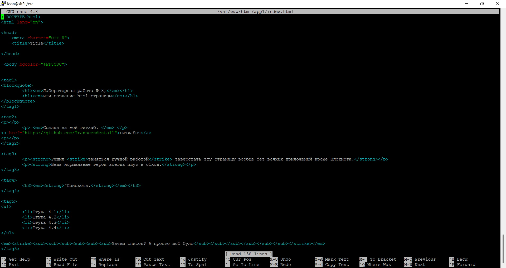

Сохраняем.
Вот они: папка первого приложения и сама веб-страничка:

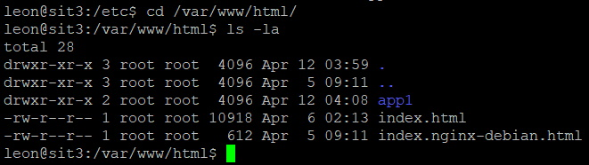

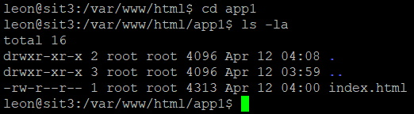


Затем обновляем nginx:
```
sudo nginx -s reload
```

И устраиваем проверку. Переходим по адресу моего сервера (теперь это http://20.25.62.64/). И что бы вы думали??? Оно работает! Ура!

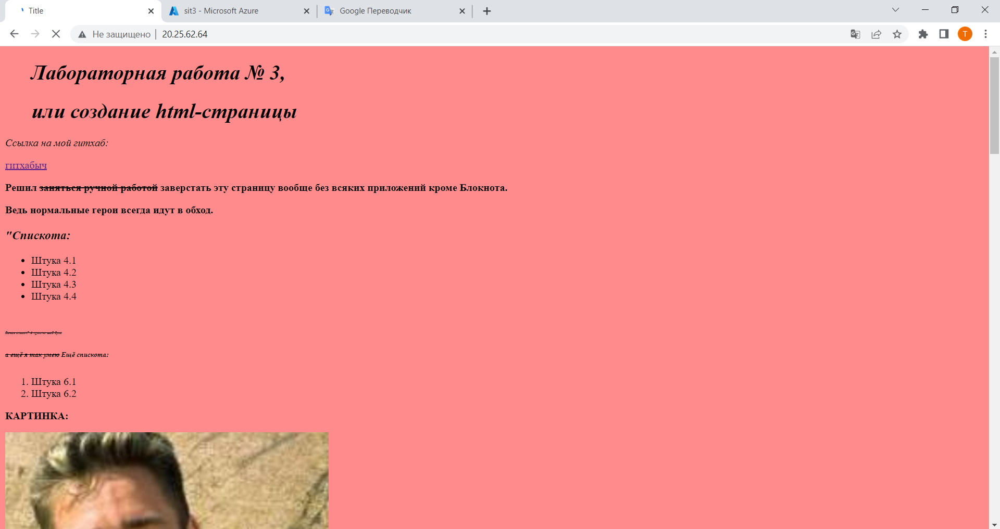

_________________________

Теперь нужно сделать второе приложение. Тут всё аналогично, но появляется несколько новых фич.

Для начала возвращаемся в /etc/nginx/sites-enabled/default с помощью команды
```
sudo nano /etc/nginx/sites-enabled/default
```

Вносим пару изменений:
1) Порт 80 меняем везде на 7777
2) Меняем директорию
```
root /var/www/html/app1
```
на требуемую
```
root /var/www/html/app2
```
3) Меняем старое location / на location /docs, так как нам требуется, чтобы страница была доступна не просто на 7777-м порте, а в отдельной docs. Там же $uri/ меняем на index.html и прописываем отдельно ошибку 404 для location /, чтобы нельзя было попасть просто вне docs.
Должно получиться как-то так:

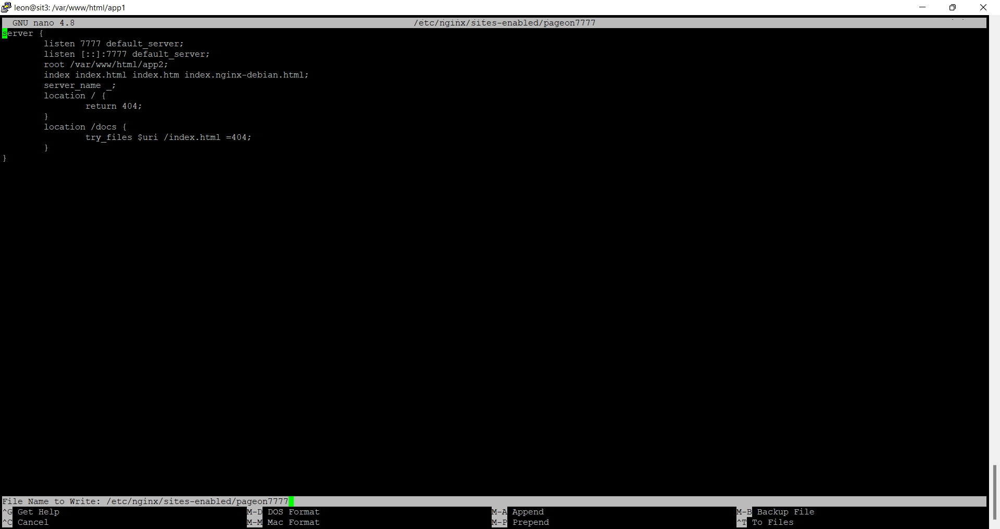

Сохраняем результат в отдельный файл. Как обозвать? Ну не знаю, я так и назвал: pageon7777.

Дальше всё как с первым приложением: идём в /var/www/html/, создаём новую папку app2, пихаем в неё новый файл index.html. Никаких изменений. Вообще. Все команды те же самые.

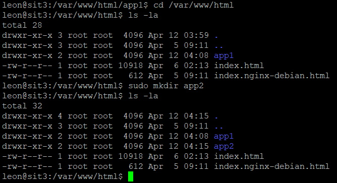
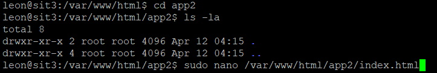

В новый html я скопипастил уже другую лабу фронтенда:

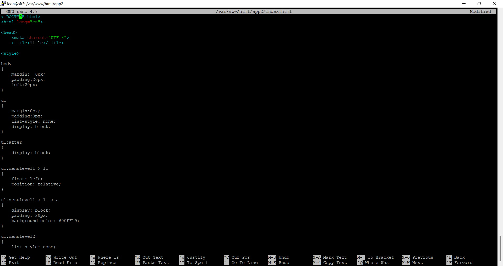

Сохраняем.

А вот тут скрывается отдельный прикол. Нельзя так просто взять и открыть новый порт 7777. Я работаю на Азуре, потому я пошёл на его сайт и там в "Группе безопасности сети" отдельно указал разрешение на этот порт. Без этого бы ничего не работало.


После этого перезагружаем nginx, всё по классике.

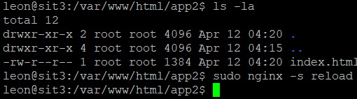

Ну а дальше проверяем работоспособность.
Открываем браузер, идём по адресу http://20.25.62.64:7777/docs/
Оно тоже работает, и это хорошо.

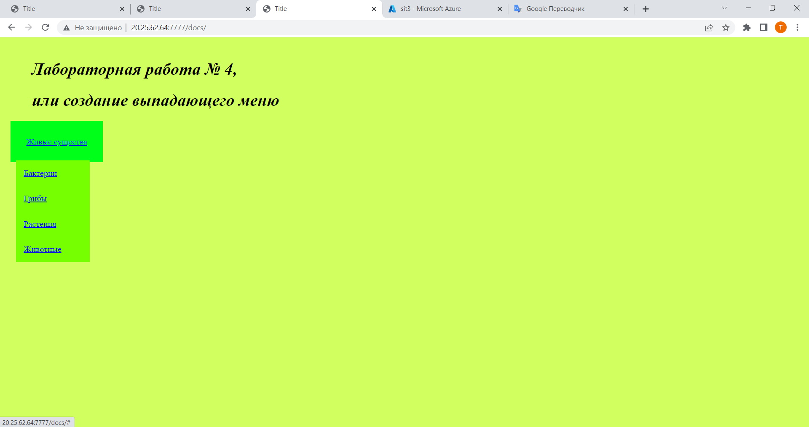
